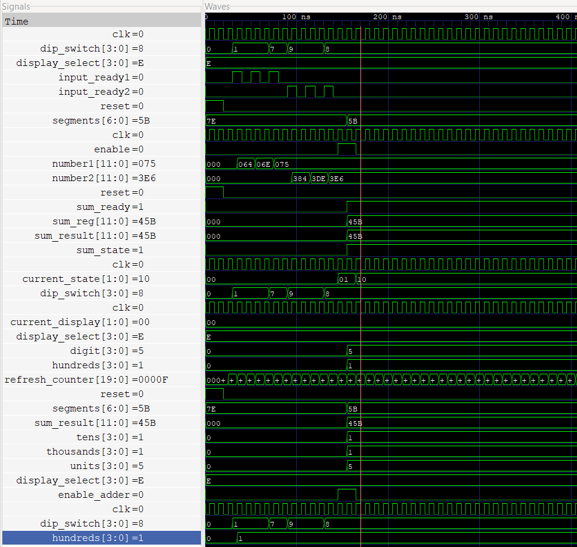
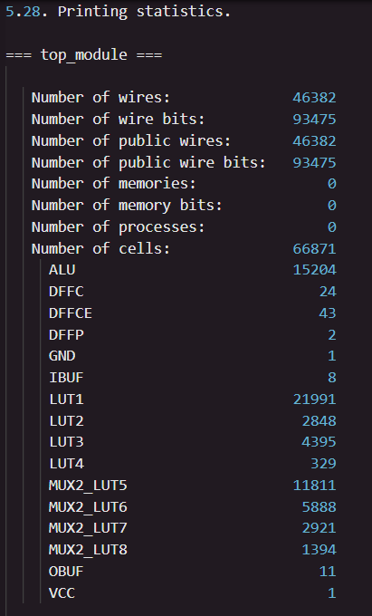
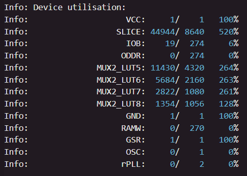

# LecturaSumador
### Segundo proyecto del curso de Diseño Lógico  
Karina Quiros Avila  
Eduardo Tencio Solano  
Pablo Elizondo Espinoza  

## Resumen introductorio
Como parte importante en la ingeniería electrónica, se tienen los lenguajes de descripción de hardware, que permiten tener programas asistidos por computadora y sistemas lógicos que resuelvan tareas complejas de manera eficiente. Este proyecto pretende desarrollar una aplicación en esta área, haciendo uso de una FPGA, algunos componentes electrónicos y el diseño de un circuito, el cual reciba valores numéricos, los sume y finalmente sea capaz de desplegar el resultado en un conjunto de cuatro displays de 7 segmentos.

## Descripción general
En un inicio, el proyecto pretendía desarrollar un modelo de hardware que fuera capaz de leer datos desde un teclado hexadecimal, los procesara y los recolectara para hacer los cálculos necesarios (sumar los valores ingresados); sin embargo, debido a ciertas complicaciones con el desarrollo de esta parte del proyecto, se abrió la posibilidad de trabajar con un deep switch que hiciera llegar los datos.
Partiendo de la modificación anterior, el objetivo es sumar dos números de tres dígitos decimales cada uno; así las cosas, mediante el deep switch es posible ingresar tanto las unidades, decenas y centenas para cada uno de los números requeridos, seperando el proceso por medio de dos botones que habilitan las señales necesarias para indicar el estado actual del procedimiento (pudiéndose representar como una máquina de estados finitos).  
Ahora bien, el primer subsistema consiste en el módulo de lectura y procesamiento para los datos ingresados por medio del deep switch, luego está la lógica del módulo sumador que se encarga de recibir los dos números ya formados y entregar el resultado de su suma; finalmente, para poder ver físicamente el resultado de la suma, está el subsistema de despliegue en los displays de 7 segmentos.  
Todo lo anterior, tiene como principales objetivos el poder comprender el proceso de sincronizar datos que son asincrónicos en un inicio, implementar un procedimiento de captura de datos (por medio del switch para este caso), aplicar un algoritmo de suma sencillo, así como lograr el despliegue en los displays de 7 segmentos y colaborar en equipo para lograr desarrollar el proyecto lo mejor posible. 

## Descripción del funcionamiento general y de sus subsistemas
Como ya se mencionó en los apartados anteriores, el proyecto cuenta con varios submódulos que cumplen funciones diferentes y específicas. Desde la recepción y el procesamiento de señales, hasta los cálculos aritméticos y el despliegue de los datos. Se muestra a continuación una descripción del funcionamiento de cada uno de estos.

### Módulo principal (Top)

Este es el módulo que conecta todos los demás, recibe las señales, las analiza y las asigna a cada uno de los otros submódulos.
El módulo se instancia con las siguientes señales:

Y se conecta por ejemplo de la siguiente manera, con el módulo que maneja la entrada de señales provenientes del switch:

De la misma manera como se conecta con el módulo que procesa la entrada de los datos, el module_Top se conecta con el adder_submodule y el display_multiplexer para hacer los cálculos aritméticos necesarios y desplegar la suma en los displays, su funcionamiento se detalla en los siguientes apartados. 

### Subsistema de lectura y procesamiento de datos

Este submódulo llamado en el archivo como input_manager.sv, es el que va registrando los datos que se van ingresando con el deep switch, utiliza las siguientes variables.

Como el sistema lo que hace es ir recogiendo cada una de las cifras que van a componer el número por separado, se utiliza un "case" dentro de un "flip-flop" de forma que se recolectan las centenas primeramente, luego las decenas y finalmente las unidades, se va actualizando el valor de la variable state para corroborar cuáles dígitos son los que se han ingresado. Finalmente se levanta una bandera para indicar que se ingresaron y registraron correctamente los tres dígitos de uno de los dos números y se procede a formar el número decimal de tres cifras, para luego enviarlo al módulo principal (Top) y que el número sea procesado por el sumador. El mismo proceso se repite para el segundo número y en caso de querer restablecer todo y volver al inicio, se puede presionar el botón de reset. 

### Subsistema de suma aritmética 

Este subsistema es el encargado de recibir y sumar los dos números formados por el subsistema de lectura y procesamiento de datos. Su estructura es relativamente corta, según se muestra a continuación.

Este subsistema tiene que corroborar ciertos aspectos antes y después de aplicar la suma. Primero se debe de verificar que los dos números a sumar estén listos y ya hayan sido enviados desde el subsistema de procesamiento de los datos ingresados; una vez verificado esto, dentro de un flip-flop se hace una suma de ambos números en el flanco positivo del reloj siempre que la señal enable esté en alto, seguidamente se activa la señal sum_ready que indica cuando la suma está lista y se produce una salida con el resultado de la suma. 

### Subsistema de procesamiento de datos y despliegue en displays de 7 segmentos

Finalmente se encuentra el subsistema que procesa los datos del resultado de la suma y lo prepara para poderse mostrar en 4 displays de 7 segmentos. Se necesita de al menos 4 displays de 7 segmentos pues el máximo resultado de la suma que se puede obtener, es un número decimal de 4 cifras que corresponde al número 1998. 

Este proceso de poder mostar el resultado de la suma en los displays conlleva varios pasos. Primero se debe de recibir el resultado de la suma y separar sus dígitos en unidades, decenas, centenas y miles (según sea necesario), esto debido a que hay un display para cada posición mencionada. Luego hay un "flip-flop" que sirve como contador para actualizar el display encendido y el código que se le va a enviar a dicho display, esto se hace porque como se trabaja con 4 displays entonces se pueden multiplexar para así ahorrar espacio y componentes electrónicos, de forma que solo estará un único display encendido a la vez, pero como cambian tan rápido el ojo humano no es capaz de darse cuenta de estos cambios entre cada display. 

El contador va cambiando de display conforme se actualiza, con lo cual luego es necesario hacer el siguiente paso, que es definir cuál de los 4 displays está encendido y en base a eso determinar si el código que se le enviará será para el dígito de las unidades, de las decenas, centenas o miles. Según se muestra.

Una vez que ya estén definidos los dos aspectos anteriores, solo resta codificar el dígito que se va ha mostrar en el código para el display de 7 segmentos, según se muestra a continuación.

Finalmente, el subsistema lanza como salida la variable segments que contiene el código adecuado para mostar en los displays el dígito que corresponda para cada instante de tiempo y el proceso se vuelve a repetir para cada uno de los dígitos de la suma. Así, el resultado final será poder observar los cuatro displays encendidos al mismo tiempo desplegando el resultado de la suma de los valores ingresados por medio del deep switch. 

## Analisis de la simulación

En esta simulación del top_module, se observa el comportamiento de un sistema diseñado para recibir entradas a través de un dip switch, sumar los valores obtenidos y desplegar el resultado en un display de 7 segmentos. A continuación, se detalla el análisis de las señales y el funcionamiento del sistema en el instante capturado en la simulación.

El sistema opera sincronizado por una señal de reloj (clk), la cual se encuentra en estado bajo (0) en el momento capturado. Este reloj controla la máquina de estados finita (FSM) del sistema, que en este caso está en el estado 10 en binario, correspondiente al estado 2 en decimal. Este estado es clave en la operación de suma, ya que coincide con la fase en la que las señales de entrada han sido capturadas y la suma ha sido realizada.

El valor capturado por el dip switch (dip_switch[3:0]) es 8 en hexadecimal, lo que corresponde a 1000 en binario. Este valor es procesado por el input model del sistema, que produce dos números a partir de las entradas: number1 = 075 (hexadecimal, equivalente a 117 en decimal) y number2 = 3E6 (hexadecimal, equivalente a 998 en decimal). Ambos números están listos para la operación de suma, como lo indica el estado de las señales de preparación de entrada (input_ready1 y input_ready2), ambas en 1.

El sumador ha procesado correctamente estos dos números, generando un resultado de 45B en hexadecimal, equivalente a 1115 en decimal. Este resultado ha sido almacenado en el registro de suma (sum_reg) y está listo para ser mostrado en el display, lo que es confirmado por la activación de la señal sum_ready, también en 1.

La lógica de control del display se gestiona a través de la señal display_select[3:0], que en este caso tiene un valor de E (hexadecimal). Esta señal determina cuál de las tres posiciones (unidades, decenas o centenas) será actualizada en el display. El valor que se está mostrando actualmente en el display es 00 (hexadecimal), lo cual sugiere que en este instante el sistema está en un ciclo de refresco o en una fase intermedia antes de actualizar la información visual.

En cuanto a los segmentos del display, el valor observado en la señal segments[6:0] = 5B indica que un número específico se está desplegando, como parte de la representación del resultado. De manera adicional, los valores de las unidades (units[3:0] = 5), decenas (tens[3:0] = 1) y centenas (hundreds[3:0] = 1) están procesando adecuadamente el valor 1115, que es el resultado final de la suma.

Finalmente, la señal refresh_counter tiene un valor de 0000F (hexadecimal), esta relacionado con la lógica de refresco del display, asegurando que las posiciones correspondientes a unidades, decenas y centenas se actualicen correctamente de acuerdo con el valor a mostrar.

## Analisis del consumo

A continuación, se presenta el analisis del consumo de recursos lógicos (LUTs, FFs, etc.) reportado por las herramientas de diseño al implementar el proyecto en la FPGA Tang Nano 9K. Este análisis es crucial para entender los límites del dispositivo y determinar si el diseño es viable o requiere ajustes para optimizar su eficiencia.

El diseño en la FPGA Tang Nano 9K excede drásticamente sus capacidades lógicas. El principal problema es el uso excesivo de SLICEs, alcanzando un 520% de la capacidad total disponible, con 44944 SLICEs utilizados frente a los 8640 disponibles. Esta es la limitación más crítica.

Las LUTs también están significativamente sobreutilizadas. El uso de MUX2_LUT5 es del 264%, con 11430 unidades disponibles en lugar de las 4320 permitidas. MUX2_LUT6 y MUX2_LUT7 también superan la capacidad con un 263% y un 261%, respectivamente. Este alto consumo de LUTs indica una complejidad notable en las operaciones combinacionales, impidiendo una implementación eficiente en la FPGA.

Respecto a los flip-flops (FFs), aunque no se detalla su número exacto, no se menciona una sobreutilización crítica, lo que sugiere que se están utilizando de manera más eficiente en comparación con las LUTs.

El uso de bloques de entrada/salida (IOBs) es mínimo, con solo un 6% de la capacidad total (19 de 274) utilizada. Esto sugiere que el diseño no enfrenta limitaciones en las interfaces de entrada/salida, sino que la restricción principal proviene de la lógica interna.

En cuanto al consumo de potencia, aunque no se proporciona un desglose específico, basadas en el uso de recursos, se puede asumir que: 

Consumo Dinámico: Este se relaciona con la cantidad de LUTs, FFs y otros elementos activos. Dado el exceso de LUTs, el consumo dinámico es probablemente muy alto, ya que cada LUT activa consume potencia durante las operaciones lógicas. Esto coloca al diseño por encima de la capacidad manejable de la FPGA.

Consumo Estático: Este consumo, que ocurre en reposo, es normalmente menor y depende de la tecnología de fabricación y la configuración de recursos de la FPGA. Aunque el consumo estático sería normal, su impacto se ve eclipsado por el elevado consumo dinámico.

## Análisis de velocidades de operación
El diseño fue implementado con un reloj de operación de 27 MHz, el cual es fundamental para controlar el correcto funcionamiento del sistema. Dentro del módulo display_multiplexer, el reloj sincroniza el proceso de refresco de los displays, lo que asegura que se muestren correctamente las unidades, decenas, centenas y miles del resultado.

El flip-flop dentro del módulo controla un contador de refresco de 20 bits, que incrementa su valor en cada ciclo de reloj. Cuando el contador alcanza 10,000 ciclos, se reinicia y avanza al siguiente display (unidades, decenas, centenas o miles). Esto garantiza que cada display se actualice de manera cíclica, permitiendo que el número completo se muestre en los displays de 7 segmentos, alternando rápidamente entre ellos.

El aumentar la velocidad del reloj tendría implicaciones importantes, ya que reduciría el tiempo entre las actualizaciones del contador de refresco, lo que podría hacer que el ciclo de displays fuera demasiado rápido para que el ojo humano los perciba adecuadamente. Además, aumentar la frecuencia de reloj implica un mayor consumo energético y provocar problemas de temporización dentro del diseño.
 

